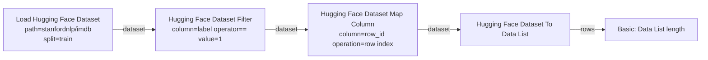

# Hugging Face Dataset Loader

A custom [ComfyUI](https://docs.comfy.org/get_started) node that loads a
[Hugging Face](https://huggingface.co/) dataset and makes it available inside
ComfyUI for further processing.

It loads a dataset from the Hugging Face Hub or from local/remote files using the
[`datasets`](https://huggingface.co/docs/datasets/loading) library and exposes it
in two forms:

- **`dataset`** — the raw `datasets.Dataset` object of the selected split (a
  lazy `datasets.IterableDataset` when `streaming` is on), handed to ComfyUI as
  an opaque `HUGGINGFACE_DATASET` value.
- **`rows`** — a ComfyUI *Data List* of row dicts (one dict per row), so every
  record can be processed further with generic data-handling nodes, for example
  from the **Basic data handling** node pack (convert to a ComfyUI `LIST` or
  `Data List`, access fields, filter, ...).

The pack also ships a set of **processing nodes** that consume the `dataset`
output and expose the data-wrangling methods of the `datasets` library
(shuffling, filtering, column selection, ...) as graph nodes, so a dataset can
be shaped *before* its rows are materialized — see
[Dataset nodes](#dataset-nodes).

## Requirements

- [ComfyUI](https://docs.comfy.org/get_started)
- Python package `datasets` (Hugging Face). The node imports it **lazily**, so
  ComfyUI still starts when it is missing — you only get a clear error when you
  actually try to load a dataset:

  ```bash
  pip install datasets
  ```

> [!NOTE]
> **JPEG XL images.** If you want to load datasets whose images are stored as
> **JPEG XL** (`.jxl`), make sure the Pillow JPEG XL plugin is installed as
> well.
>
> ```bash
> pip install pillow-jxl-plugin
> ```
>
> The plugin is **optional** and you must install it yourself: the node starts
> and runs fine without it, only the JPEG XL images then fail to decode. The
> ComfyUI startup log tells you whether it is active — it prints
> `JPEG XL image support: enabled` when the plugin is installed and
> `JPEG XL image support: disabled` otherwise.

## Quickstart

### Recommended Installation (ComfyUI-Manager)

1. Install [ComfyUI-Manager](https://github.com/ltdrdata/ComfyUI-Manager).
2. Look up the **"Hugging Face dataset"** extension in ComfyUI-Manager and install it.
3. Restart ComfyUI.

### Alternative (Manual Installation)

1. Install [ComfyUI](https://docs.comfy.org/get_started).
2. Clone this repository under `ComfyUI/custom_nodes`:
   ```bash
   git clone https://github.com/StableLlama/ComfyUI-huggingface_dataset.git
   ```
3. Install the `datasets` dependency into ComfyUI's Python environment:
   ```bash
   pip install datasets
   ```
4. Restart ComfyUI.

## Node

### Load Hugging Face Dataset

Loads a dataset and outputs the loaded `dataset` plus a `rows` Data List.

| Input | Type | Default | Description |
| --- | --- | --- | --- |
| `path` | STRING | `""` | Hub dataset id (e.g. `stanfordnlp/imdb`) **or** a local/remote file or directory (see [Sources](#sources)). |
| `loader` | STRING | `auto` | `auto` (infer from file extension), `hub`, or one of `csv`, `json`, `parquet`, `arrow`, `text`. |
| `split` | COMBO | `train` | Split to load. A dropdown listing the splits of the selected source (see [Split selection](#split-selection)). |
| `config` | STRING | `""` | Config/subset name for Hub datasets that have several configs (e.g. `nyu-mll/glue` + config `mrpc`). |
| `revision` | STRING | `""` | Optional Hub revision: tag, branch name, or commit hash. |
| `streaming` | BOOLEAN | `False` | Load the split as a lazy `IterableDataset` instead of downloading/caching it fully. |
| `limit` | INT | `-1` | Maximum number of rows to materialize into `rows`. `-1` = all rows. |

| Output | Type | Description |
| --- | --- | --- |
| `dataset` | `HUGGINGFACE_DATASET` | The raw `datasets.Dataset` of the selected split (or an `IterableDataset` with `streaming` on). |
| `rows` | `*` (Data List) | List of row dicts (one dict per row), capped by `limit`. |

### Split selection

The `split` dropdown is filled with the splits the selected dataset actually
exposes:

- it **refreshes automatically** when you change `path`, `config`, `revision`
  or `loader`, and there is also a **Refresh splits** button to re-query
  manually;
- a **sensible default** is picked (in the order `train` → `validation` →
  `test`) when the dataset has no `train` split - e.g. a dataset that only ships
  a `test` split selects `test` automatically;
- listing the splits requires the `datasets` package and (for Hub datasets)
  network access. When the splits cannot be determined (offline, or a
  multi-config dataset without a `config`), the dropdown falls back to
  `train`/`test`/`validation` and the node validates the split when it runs.
- `datasets` slicing syntax is still honoured for values that come from an older
  workflow, e.g. a stored `train[:100]` or `train[:10%]` continues to work.

### Streaming vs. full load

With `streaming` off (the default) `datasets` downloads and caches the **whole
split** before the first `limit` rows are materialized into the `rows` Data
List - so `limit` caps the size of the returned `rows`, but *not* the download.
With `streaming` on, the node loads the split as a lazy
`datasets.IterableDataset` instead: nothing is downloaded until it is iterated,
which makes it a memory/bandwidth-friendly way to feed only the first `limit`
rows of a very large dataset into the graph. Note the `dataset` output is then
an `IterableDataset` (no `len()`, single-pass) rather than a `datasets.Dataset`.

### Sources

- **Hugging Face Hub** — pass the repository id (`namespace/name`) as `path`, e.g.
  `stanfordnlp/imdb`, `nyu-mll/glue` (with `config`), or `HuggingFaceFW/fineweb` (with
  a `revision`). Leave `loader` at `auto`.
- **Local/remote files** — `csv`, `tsv`, `json`, `jsonl`, `parquet`, `arrow`,
  `txt`. With `loader = auto` the format is inferred from the file extension,
  otherwise pick the matching file builder explicitly. Globs (e.g.
  `data/*.parquet`) and remote `https://`/`hf://` URLs work too.
- **Local dataset directory** — a directory in Hugging Face dataset format.

### Example workflows

Load the IMDb reviews `stanfordnlp/imdb` dataset and count its rows:


Feed the rows into the **Basic data handling** node pack for per-row processing,
e.g. turn each row dict into a string, or take fields out of a specific row:


> [!TIP]
> `rows` is already a ComfyUI *Data List* — it can be connected straight into the
> **Data List** and **LIST** nodes of the **Basic data handling** pack.

## Dataset nodes

The loader's `dataset` output is an opaque `HUGGINGFACE_DATASET` value. The
processing nodes below take it as input, work on the underlying `datasets`
object and hand the result back as a new `HUGGINGFACE_DATASET`, so transforms
chain together (e.g. *Shuffle → Filter → Map Column → Select Columns*). Nodes
that only exist on a fully-loaded `datasets.Dataset` — marked **loaded only**
below — raise a clear error when given a streaming dataset instead of a cryptic
traceback: disable `streaming` on the loader for those.

### Transform nodes

| Node | What it does | Streaming? |
| --- | --- | --- |
| **Hugging Face Dataset Shuffle** | Randomly reorders the rows (`shuffle(seed)`). | ✅ |
| **Hugging Face Dataset Skip** | Drops the first `n` rows (`skip(n)`). | ✅ |
| **Hugging Face Dataset Take** | Keeps only the first `n` rows (`take(n)`). | ✅ |
| **Hugging Face Dataset Sort** | Sorts the rows by a `column` (`sort`). | loaded only |
| **Hugging Face Dataset Shard** | Keeps shard `index` of the dataset split into `num_shards` (`shard`). | ✅ |
| **Hugging Face Dataset Select Rows** | Keeps rows by `indices` — comma-separated `0,2,4` and/or slices `0:100`, `0:100:2` (`select`). | loaded only |
| **Hugging Face Dataset Select Columns** | Keeps only the comma-separated `columns` (`select_columns`). | ✅ |
| **Hugging Face Dataset Remove Columns** | Removes the comma-separated `columns` (`remove_columns`). | ✅ |
| **Hugging Face Dataset Rename Column** | Renames one column (`rename_column`). | ✅ |
| **Hugging Face Dataset Flatten** | Expands nested columns into top-level ones (`flatten`). | loaded only |
| **Hugging Face Dataset Filter** | Keeps rows whose `column` satisfies an `operator` against `value` (`filter`). | ✅ |
| **Hugging Face Dataset Map Column** | Adds/replaces `column` per row from a `constant`, a copy of another column, or the `row index` (`map`). | ✅ |
| **Hugging Face Dataset Train/Test Split** | Randomly splits into `train` and `test` outputs (`train_test_split`). | loaded only |
| **Hugging Face Dataset Unique** | Returns the unique `column` values as a *Data List* (`unique`). | loaded only |

**Filter operators:** `==`, `!=`, `<`, `<=`, `>`, `>=` (the `value` text is
coerced to the column's type, so numeric columns compare with plain numbers),
`contains` / `not contains` / `starts with` / `ends with`, `in` / `not in`
(comma-separated `value` list), and `is null` / `is not null`.

### Conversion nodes (LIST and Data List)

The "Basic data handling" pack distinguishes two list shapes, and either kind of
dataset (fully-loaded **or** streaming) can be turned into both:

| Node | Output | Description |
| --- | --- | --- |
| **Hugging Face Dataset To LIST** | `LIST` | One Python list value of all rows (a *LIST* as Basic data handling defines it, so it feeds `List length`, `List get item`, ...). With a `column` set, the list holds that column's values instead of row dicts. |
| **Hugging Face Dataset To Data List** | `*` (Data List) | The same rows exposed as a ComfyUI *Data List* (like the loader's `rows` output): Basic *Data List* nodes receive the whole list in one call, other nodes run once per row. |

Both honour a `limit` widget (`-1` = all rows) — handy for pulling only the
first rows of a large streaming dataset.

### Example workflow

Load IMDb, keep only positive reviews (`label` `==` `1`), add a row index and
feed the result to a Basic-data-handling *Data List*:



## Development

```bash
# Lint & format
python -m ruff check .
python -m ruff format .

# Type check (strict)
python -m mypy .

# Tests (no network / no datasets required)
python -m pytest tests/
```

## License

[GPL-3.0](./LICENSE)
