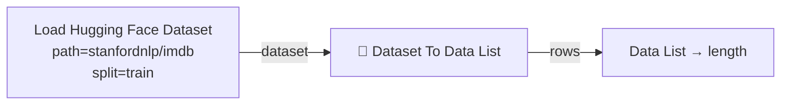
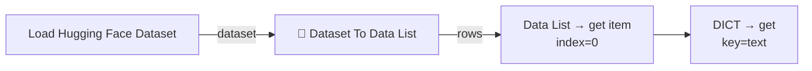
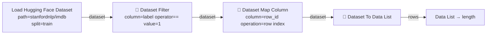
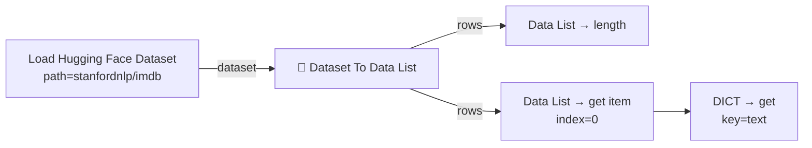

# Hugging Face Dataset Loader

[](./LICENSE)
[](./pyproject.toml)
[](https://docs.comfy.org/custom-nodes/intro)

A custom [ComfyUI](https://docs.comfy.org/get_started) node that loads a
[Hugging Face](https://huggingface.co/) dataset and makes it available inside
ComfyUI for further processing.

Every node ships **in-app documentation and parameter tooltips** — hover a node
and open its help (info) panel, or view the node's page in the **Node Library**
— and ready-made **example workflows** are available from the template browser
(`Workflow → Browse Templates`).

It loads a dataset from the Hugging Face Hub or from local/remote files using the
[`datasets`](https://huggingface.co/docs/datasets/loading) library and exposes it
as an opaque `HUGGINGFACE_DATASET` value:

- **`dataset`** — the raw `datasets.Dataset` object of the selected split (a
  lazy `datasets.IterableDataset` when `streaming` is on), handed to ComfyUI as
  an opaque `HUGGINGFACE_DATASET` value.

The pack also ships a set of **processing nodes** that consume the `dataset`
output and expose the data-wrangling methods of the `datasets` library
(shuffling, filtering, column selection, ...) as graph nodes, so a dataset can
be shaped *before* it is materialized, plus **conversion nodes** that turn it
into ComfyUI data:

- **`🤗 Dataset To Data List`** — a ComfyUI *Data List* of row dicts (one per
  row), so every record can be processed further with generic data-handling
  nodes, for example from the **Basic data handling** node pack (count, get an
  item, map per row, ...).
- **`🤗 Dataset To LIST`** — the same rows as one Python list value.

Every emitted value is valid on its own in ComfyUI: numpy scalars/arrays become
plain Python, and **image cells become a single-image `IMAGE`** (with alpha, if
any, exposed as a virtual `<image>_mask` `MASK` column), so an image column can
be wired straight into `Preview Image` / `Save Image`.

## Requirements

- [ComfyUI](https://docs.comfy.org/get_started)
- Python package `datasets` (Hugging Face). It is **installed automatically**
  when you install this pack through ComfyUI-Manager, the Comfy Registry or a
  `pip install` of the repo — there is nothing extra to do. The nodes import it
  **lazily**, so ComfyUI still starts even if it is missing; you only get a
  clear install message when you actually try to load a dataset. When you
  installed from a bare `git clone` without an installer, run once:

  ```bash
  pip install -r requirements.txt   # or: pip install datasets
  ```

> [!NOTE]
> **JPEG XL images.** If you want to load datasets whose images are stored as
> **JPEG XL** (`.jxl`), make sure the Pillow JPEG XL plugin is installed as
> well.
>
> ```bash
> pip install pillow-jxl-plugin
> ```
>
> The plugin is **optional** and you must install it yourself: the node starts
> and runs fine without it, only the JPEG XL images then fail to decode. The
> ComfyUI startup log tells you whether it is active — it prints
> `JPEG XL image support: enabled` when the plugin is installed and
> `JPEG XL image support: disabled` otherwise.

## Quickstart

### Recommended Installation (ComfyUI-Manager or the Comfy Registry)

1. Install [ComfyUI-Manager](https://github.com/ltdrdata/ComfyUI-Manager) (or
   use the **Registry** tab in ComfyUI Desktop / `comfy node install`).
2. Look up the **"Hugging Face dataset"** extension and install it.
3. Restart ComfyUI.

The `datasets` dependency is installed for you automatically.

### Alternative (Manual Installation)

1. Install [ComfyUI](https://docs.comfy.org/get_started).
2. Clone this repository under `ComfyUI/custom_nodes`:
   ```bash
   git clone https://github.com/StableLlama/ComfyUI-huggingface_dataset.git
   ```
3. Install the runtime dependencies into ComfyUI's Python environment:
   ```bash
   pip install -r requirements.txt
   ```
4. Restart ComfyUI.

## Node

### Load Hugging Face Dataset

Loads a dataset and outputs the raw `dataset` as an opaque
`HUGGINGFACE_DATASET` value. The loader materializes nothing itself: shape the
dataset with the transform nodes and turn it into ComfyUI data with the
conversion nodes (`🤗 Dataset To Data List` / `To LIST`) — see
[Dataset nodes](#dataset-nodes).

| Input | Type | Default | Description |
| --- | --- | --- | --- |
| `path` | STRING | `""` | Hub dataset id (e.g. `stanfordnlp/imdb`) **or** a local/remote file or directory (see [Sources](#sources)). |
| `loader` | STRING | `auto` | `auto` (infer from file extension), `hub`, or one of `csv`, `json`, `parquet`, `arrow`, `text`. |
| `split` | COMBO | `train` | Split to load. A dropdown listing the splits of the selected source (see [Split selection](#split-selection)). |
| `config` | STRING | `""` | Config/subset name for Hub datasets that have several configs (e.g. `nyu-mll/glue` + config `mrpc`). |
| `revision` | STRING | `""` | Optional Hub revision: tag, branch name, or commit hash. |
| `streaming` | BOOLEAN | `False` | Load the split as a lazy `IterableDataset` instead of downloading/caching it fully. |

| Output | Type | Description |
| --- | --- | --- |
| `dataset` | `HUGGINGFACE_DATASET` | The raw `datasets.Dataset` of the selected split (or an `IterableDataset` with `streaming` on). |

> [!IMPORTANT]
> **Upgrading from 1.x:** the loader's `rows` output and its `limit` widget were
> removed. They were equivalent to `dataset` → `🤗 Dataset To Data List`, but the
> rows were materialized on every run — even when nothing consumed them. Fix old
> workflows by connecting the loader's `dataset` output to a
> `🤗 Dataset To Data List` node and bounding the rows with `🤗 Dataset Take`
> (or the conversion node's own `limit`).

### Split selection

The `split` dropdown is filled with the splits the selected dataset actually
exposes:

- it **refreshes automatically** when you change `path`, `config`, `revision`
  or `loader`, when a workflow is loaded, and again when you click **Force
  reload** (see below);
- a **sensible default** is picked (in the order `train` → `validation` →
  `test`) when the dataset has no `train` split - e.g. a dataset that only ships
  a `test` split selects `test` automatically;
- listing the splits requires the `datasets` package and (for Hub datasets)
  network access. When the splits cannot be determined (offline, or a
  multi-config dataset without a `config`), the dropdown falls back to
  `train`/`test`/`validation` and the node validates the split when it runs.
- `datasets` slicing syntax is still honoured for values that come from an older
  workflow, e.g. a stored `train[:100]` or `train[:10%]` continues to work.

### Streaming vs. full load

With `streaming` off (the default) `datasets` downloads and caches the **whole
split** and the node returns a `datasets.Dataset`; `Take` / `Filter` / … then
work on local data. With `streaming` on, the node loads the split as a lazy
`datasets.IterableDataset` instead: nothing is downloaded until it is iterated,
which makes it a memory/bandwidth-friendly way to feed only the first rows of a
very large dataset into the graph — put a `🤗 Dataset Take` (or a
`Select` / `Shard`) in front of the conversion node. Note the `dataset` output is
then an `IterableDataset` (no `len()`, single-pass) rather than a
`datasets.Dataset`.

### Force reload

ComfyUI caches a node's output on its inputs, so re-running a workflow normally
reuses the dataset you already loaded — even if the source changed on the Hub or
on disk. The loader has a single **Force reload** button that does two things:
it re-queries the dataset's splits (so the `split` dropdown is in sync, replacing
the old manual "Refresh splits" button) and bumps an internal `reload_tick`
counter (a hidden input) to invalidate the cache. The dataset is then fetched
fresh the next time you run the workflow.

### Sources

- **Hugging Face Hub** — pass the repository id (`namespace/name`) as `path`, e.g.
  `stanfordnlp/imdb`, `nyu-mll/glue` (with `config`), or `HuggingFaceFW/fineweb` (with
  a `revision`). Leave `loader` at `auto`.
- **Local/remote files** — `csv`, `tsv`, `json`, `jsonl`, `parquet`, `arrow`,
  `txt`. With `loader = auto` the format is inferred from the file extension,
  otherwise pick the matching file builder explicitly. Globs (e.g.
  `data/*.parquet`) and remote `https://`/`hf://` URLs work too.
- **Local dataset directory** — a directory in Hugging Face dataset format.

### Example workflows

Load the IMDb reviews `stanfordnlp/imdb` dataset, materialize them as a *Data
List* and count the rows with the **Basic data handling** pack
(`Basic → Data List → length`):



Take the review text of one specific row — a *Data List* holds row dicts, so
first pull a row, then read its `text` field:



> [!TIP]
> See [Working with Basic data handling](#working-with-basic-data-handling) for
> many more ways to slice, map and consume the materialized rows with the
> **Basic data handling** pack.

## Dataset nodes

The loader's `dataset` output is an opaque `HUGGINGFACE_DATASET` value. The
processing nodes below take it as input, work on the underlying `datasets`
object and hand the result back as a new `HUGGINGFACE_DATASET`, so transforms
chain together (e.g. *Shuffle → Filter → Map Column → Select Columns*). Nodes
that only exist on a fully-loaded `datasets.Dataset` — marked **loaded only**
below — raise a clear error when given a streaming dataset instead of a cryptic
traceback: disable `streaming` on the loader for those.

### Transform nodes

| Node | What it does | Streaming? |
| --- | --- | --- |
| **🤗 Dataset Shuffle** | Randomly reorders the rows (`shuffle(seed)`). | ✅ |
| **🤗 Dataset Skip** | Drops the first `n` rows (`skip(n)`). | ✅ |
| **🤗 Dataset Take** | Keeps only the first `n` rows (`take(n)`). | ✅ |
| **🤗 Dataset Sort** | Sorts the rows by a `column` (`sort`). | loaded only |
| **🤗 Dataset Shard** | Keeps shard `index` of the dataset split into `num_shards` (`shard`). | ✅ |
| **🤗 Dataset Select Rows** | Keeps rows by `indices` — comma-separated `0,2,4` and/or slices `0:100`, `0:100:2` (`select`). | loaded only |
| **🤗 Dataset Select Columns** | Keeps only the comma-separated `columns` (`select_columns`). | ✅ |
| **🤗 Dataset Remove Columns** | Removes the comma-separated `columns` (`remove_columns`). | ✅ |
| **🤗 Dataset Rename Column** | Renames one column (`rename_column`). | ✅ |
| **🤗 Dataset Flatten** | Expands nested columns into top-level ones (`flatten`). | loaded only |
| **🤗 Dataset Filter** | Keeps rows whose `column` satisfies an `operator` against `value` (`filter`). | ✅ |
| **🤗 Dataset Map Column** | Adds/replaces `column` per row from a `constant`, a copy of another column, or the `row index` (`map`). | ✅ |
| **🤗 Dataset Train/Test Split** | Randomly splits into `train` and `test` outputs (`train_test_split`). | loaded only |
| **🤗 Dataset Unique** | Returns the unique `column` values as a *Data List* (`unique`). | loaded only |
| **🤗 Dataset Count** | Returns the number of rows (`len`) as an `INT`. | loaded only |

**Filter operators:** `==`, `!=`, `<`, `<=`, `>`, `>=` (the `value` text is
coerced to the column's type, so numeric columns compare with plain numbers),
`contains` / `not contains` / `starts with` / `ends with`, `in` / `not in`
(comma-separated `value` list), and `is null` / `is not null`.

### Conversion nodes (LIST and Data List)

The "Basic data handling" pack distinguishes two list shapes, and either kind of
dataset (fully-loaded **or** streaming) can be turned into both:

| Node | Output | Description |
| --- | --- | --- |
| **🤗 Dataset To LIST** | `LIST` | One Python list value of all rows (a *LIST* as Basic data handling defines it, so it feeds `LIST → length`, `LIST → get item`, ...). With a `column` set, the list holds that column's values instead of row dicts. |
| **🤗 Dataset To Data List** | `*` (Data List) | The same rows exposed as a ComfyUI *Data List*: Basic *Data List* nodes receive the whole list in one call, other nodes run once per row. |

Both honour a `limit` widget (`-1` = all rows) — handy for pulling only the
first rows of a large streaming dataset.

Every entry they emit is a value that is valid on its own in ComfyUI: numpy
scalars/arrays become plain Python, and **image cells become a single-image
`IMAGE`** (a batch of one). `🤗 Dataset To Data List (column=image)` therefore
feeds `Preview Image` / `Save Image` directly, and row dicts (`column=""`)
contain image values, so `DICT → get (key=image)` works too.

**Transparency** follows ComfyUI's convention (`IMAGE` is RGB, alpha is a
separate `MASK` with `1` = transparent): an image column whose cells carry an
alpha channel additionally gets a virtual column **`<image>_mask`**, so
`DICT → get (key=image_mask)` feeds `ImageCompositeMasked`,
`SetLatentNoiseMask`, `GrowMask`, … and `column=image_mask` yields the masks on
their own. No virtual column is created for images without alpha, and a name
collision is resolved to `<image>_mask1`, `_mask2`, … (logged on the console).
Only the requested column is converted, so pulling a text column out of an image
dataset stays cheap.

### Example workflow

Load IMDb, keep only positive reviews (`label` `==` `1`), add a row index and
feed the result to a Basic-data-handling *Data List*:



## Working with Basic data handling

The [Basic data handling](https://github.com/StableLlama/ComfyUI-basic_data_handling)
pack provides everyday data nodes — lists, dicts, strings, maths, flow control
and more. These Hugging Face nodes hand data to it in the two shapes it already
understands, so rows can be counted, inspected, mapped and consumed with almost
no manual conversion:

- **`*` Data List** — one item per row: `🤗 Dataset To Data List`, and the
  `values` output of `🤗 Dataset Unique`.
- **`LIST`** — one Python list value: `🤗 Dataset To LIST`.

Rows are plain dicts keyed by the dataset's column names. Values are converted
into valid ComfyUI values: numpy scalars/arrays become plain Python, and image
cells become a single-image `IMAGE` (so an image column can be wired straight
into `Preview Image` / `Save Image`). Other objects (e.g. audio) pass through
unchanged. Install the Basic pack from
ComfyUI-Manager or the registry — its nodes appear under the `Basic/…` menus
(`Basic/Data List`, `Basic/LIST`, `Basic/DICT`, `Basic/STRING`, `Basic/cast`,
...).

### Whole-list nodes vs. per-row mapping

A *Data List* can be wired into Basic nodes in two ways:

- **Whole-list nodes** (`Basic/Data List` and `Basic/LIST`) receive the whole
  list in one call — e.g. `length`, `count`, `first`, `get item`,
  `convert to LIST`, `convert to Data List`.
- **Per-row mapping** — connect the Data List into any *other* Basic node (a
  `Basic/DICT`, `Basic/STRING` or `Basic/cast` node). ComfyUI then runs that
  node once for every row, and its output is a new Data List with one result
  per row. This is the idiomatic way to transform every record in one go.

### Recipes

Count the loaded rows, and read the review text of the first row:



Map every row to one field — pull `text` out of each row with a per-row
`DICT → get`, then join the results into a single string:

```mermaid
flowchart LR
    A[Load Hugging Face Dataset] -->|dataset| D[🤗 Dataset To Data List]
    D -->|rows| G[DICT → get<br/>key=text]
    G --> J[STRING → join (from data list)<br/>separator= ---]
```

- **Turn whole rows into text** — the Data List output of
  `🤗 Dataset To Data List` → `Basic/cast → to STRING`, then use any
  `Basic/STRING` node.
- **One column of all rows as a `LIST`** — `🤗 Dataset To LIST (column=text)` →
  `Basic/LIST → length` / `get item` / `first`, or
  `Basic/LIST → convert to Data List` to switch back to per-row processing.
- **Shape before materialising** — build the rows you want with the transform
  nodes first (`🤗 Dataset Filter`, `Map Column`, `Select Columns`, ...), then
  feed `🤗 Dataset To Data List` / `To LIST` into Basic.
- **Unique values** — `🤗 Dataset Unique (column=label)` →
  `Basic/Data List → length`, or `Basic/Data List → convert to LIST`.
- **Preview dataset images** — `🤗 Dataset To Data List (column=image)` →
  `Preview Image`. `datasets` hands image cells over as PIL images (lazy JPEG XL
  ones included), which ComfyUI's `IMAGE` input cannot use; the conversion nodes
  turn each one into a single-image `IMAGE` for you.
- **Images with transparency** — `column=""` (whole rows) contains both
  `image` and the virtual `image_mask`; pull each out with a per-row
  `DICT → get` and use the mask for `ImageCompositeMasked`,
  `SetLatentNoiseMask`, `GrowMask`, ….

These patterns work for every Data List the pack produces — any
`🤗 Dataset To Data List` fed from the loader or a transform chain — and the
`limit` widget (or a `Take` / `Skip`) bounds how many rows are materialised.

## Example workflow templates

The repository ships ready-made workflows under
[`example_workflows/`](./example_workflows). Once the pack is installed they
appear in ComfyUI's template browser (`Workflow → Browse Templates`) under the
**Hugging Face dataset** entry:

- `imdb_filter_to_data_list` — load IMDb, keep only positive reviews and expose
  them as a Data List.
- `imdb_map_select_to_list` — add a row index, keep the `text` column and
  export it as a LIST of strings.
- `imdb_streaming_skip_take` — load IMDb in streaming mode, skip/take rows and
  materialize a Data List without a full download.

## Development

```bash
# Lint & format
python -m ruff check .
python -m ruff format .

# Type check (strict)
python -m mypy src tests

# Tests (no network / no datasets required)
python -m pytest tests/
```

## License

[GPL-3.0](./LICENSE)
